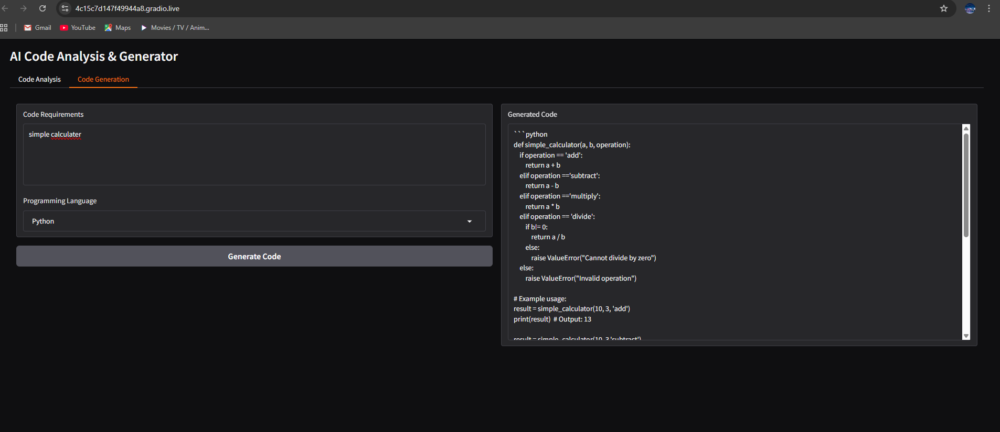

# SmartSDLC-IBM-Project
# SmartSDLC – AI Enhanced Software Development Life Cycle

## 📌 Project Overview
SmartSDLC is an AI-driven approach to enhance the traditional Software Development Life Cycle by automating requirement analysis, health monitoring, and improving efficiency.

## 🚀 Features
- Requirement Analyzer (AI-based)
- Health Monitoring AI
- Automated suggestions for SDLC phases
- Easy integration with UI

## 🛠️ Tech Stack
- Python
- Flask / Django (if applicable)
- Machine Learning (scikit-learn, TensorFlow, etc.)
- HTML/CSS/JS (for UI)

## 📂 Project Structure
- **Phase-1**: Problem statement, requirement analysis, literature survey  
- **Phase-2**: Core coding (requirement analyzer, health AI, ML models)  
- **Phase-3**: UI + Integration

## Health AI Output

## Demo Video
Watch our project demo here: [Click to Watch](https://drive.google.com/file/d/1LP9thoMf3nxvr3ZVv680mvF-JOh-xFcD/view?usp=sharing)
    
 ## 👥 Team leader
 -Divakar.P

## 👥 Team Members
- Venkatesh.T
- Levin raj.M
- Ragul.R

---
